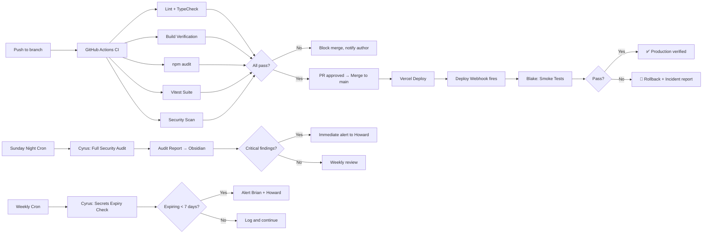

# Production Pipeline Spec

**Author:** Reese (PM)  
**Date:** March 8, 2026  
**Status:** Ready for implementation  
**Owners:** Cyrus (security/infra), Blake (QA), Marcel/Ellis/Wes (builders), Reese (coordination)

---

## Executive Summary

We have 15 agents shipping code across 7+ web projects with zero automation between commit and production. No CI, no tests, no staging gates, no secret rotation, no deploy verification. Every deploy is a coin flip.

This spec lays out a three-phase pipeline buildout over 4+ weeks. Phase 1 is high-impact, low-effort — drop-in CI workflows, automated security scans, deploy verification, and secrets tracking. Phase 2 adds test suites, staging gates, and dependency management. Phase 3 brings performance monitoring, rollback procedures, and a health dashboard.

The goal: every commit gets checked, every deploy gets verified, every vulnerability gets caught, and every secret gets rotated before it expires.

---

## Pipeline Overview



---

## Repo Inventory

| Project | Repo | GitHub Remote | Builder | Priority |
|---------|------|---------------|---------|----------|
| SailorSkills Marketplace | `~/AI/business/sailorskills/marketplace` | `standardhuman/sailorskills-marketplace` | Marcel | P0 |
| SailorSkills Pro | `~/AI/business/sailorskills/pro` | `standardhuman/sailorskills-pro-v2` | Jacques | P0 |
| Billing Dashboard | `~/AI/business/sailorskills-platform/sailorskills-billing` | `standardhuman/sailorskills-billing` | Marcel | P0 |
| Scheduler | `~/AI/business/briancline-co/scheduler` | `standardhuman/bc-scheduler` | Ellis | P1 |
| briancline.co | `~/AI/business/briancline-co/website` | `standardhuman/briancline.io` | Ellis | P1 |
| Client Intake | `~/AI/business/briancline-co/intake` | `standardhuman/briancline-intake` | Ellis | P2 |
| Detailing Site | `~/AI/business/sailorskills/detailing-site` | TBD | Wes | P2 |
| Needs Are Normal (NVC) | `~/AI/business/needs-are-normal` | TBD | Wes | P2 |

**Note:** Pro (iOS/Swift) has a different CI setup than the web projects. Jacques already has a CI workflow at `.github/workflows/ci.yml` with lint, typecheck, and unit tests. This spec focuses on the web stack; Pro CI improvements are tracked separately.

---

## Phase 1: Foundation

**Timeline:** Week 1 (March 10–14, 2026)  
**Effort:** Low — template drops, cron configs, webhook setup  
**Impact:** High — every commit gets checked, every deploy gets verified

### 1.1 GitHub Actions CI on All Active Repos

**Owner:** Reese creates template, builders drop it in  
**Deadline:** March 12

Every web repo gets the same base CI workflow. Builders copy the template, adjust project-specific settings if needed, and push.

#### Template Workflow: `.github/workflows/ci.yml`

```yaml
name: CI

on:
  push:
    branches: [main]
  pull_request:
    branches: [main]

concurrency:
  group: ci-${{ github.ref }}
  cancel-in-progress: true

jobs:
  ci:
    runs-on: ubuntu-latest
    timeout-minutes: 10

    steps:
      - uses: actions/checkout@v4

      - name: Setup Node.js
        uses: actions/setup-node@v4
        with:
          node-version: '20'
          cache: 'npm'

      - name: Install dependencies
        run: npm ci

      - name: Lint
        run: npm run lint

      - name: Type check
        run: npm run type-check

      - name: Build
        run: npm run build

      - name: Run tests
        run: npm test --if-present

      - name: Security audit
        run: npm audit --audit-level=high
```

#### Builder Checklist

Each builder confirms these `package.json` scripts exist before dropping the workflow:

- [ ] `lint` — ESLint (add `"lint": "eslint src"` if missing)
- [ ] `type-check` — TypeScript compiler check (add `"type-check": "tsc --noEmit"` if missing)
- [ ] `build` — Vite production build (should already exist)
- [ ] `test` — Vitest (add in Phase 2 if not present; CI step uses `--if-present` so it won't fail)

#### Rollout Order

1. **sailorskills-marketplace** — Marcel drops workflow, verifies green
2. **sailorskills-billing** — Marcel drops workflow
3. **bc-scheduler** — Ellis drops workflow
4. **briancline.io** — Ellis drops workflow
5. Remaining repos follow the same pattern

#### Success Criteria

- [ ] All P0/P1 repos have CI running on every push to main
- [ ] CI blocks merges on lint, type, or build failures
- [ ] `npm audit` runs on every push (non-blocking initially, blocking in Phase 2)

---

### 1.2 Weekly Cyrus Security Cron

**Owner:** Cyrus (implementation), Reese (cron scheduling)  
**Deadline:** March 14

Automated weekly security audit of all active repos.

#### Cron Configuration

```
Schedule: Every Sunday at 10:00 PM Pacific
Agent: cyrus
Task: Weekly security audit of all active repositories
```

#### Cyrus Task Script

Cyrus runs this sequence each week:

1. **Pull latest from all repos** — `git pull` on each active repo listed in the inventory above
2. **Run `/security-review` on each** — Claude Code security review covering:
   - Hardcoded secrets or credentials
   - SQL injection / XSS vulnerabilities
   - Insecure API endpoint patterns
   - Supabase RLS policy gaps
   - Dependency vulnerabilities (cross-reference with `npm audit`)
   - Environment variable exposure risks
3. **Generate report** — Save to `~/clawd/docs/security/YYYY-MM-DD-weekly-audit.md`
4. **Sync to Obsidian** — Copy to `SailorSkills/Architecture/Security Audits/YYYY-MM-DD-weekly-audit.md`
5. **Announce findings** — Message Howard with summary
6. **Critical findings** — If any critical/high severity issues found, immediately flag to Howard and Brian

#### Report Template

```markdown
# Weekly Security Audit — YYYY-MM-DD

**Auditor:** Cyrus  
**Repos scanned:** [count]  
**Critical findings:** [count]  
**High findings:** [count]  
**Medium findings:** [count]  
**Low findings:** [count]

## Critical / High Findings

### [Repo Name] — [Finding Title]
- **Severity:** Critical / High
- **Description:** ...
- **Location:** file:line
- **Recommended fix:** ...
- **Assigned to:** [builder]

## Medium / Low Findings

[Summary table]

## Dependency Audit Results

| Repo | Critical | High | Moderate | Low |
|------|----------|------|----------|-----|
| ...  | ...      | ...  | ...      | ... |

## Notes

[Context, recurring issues, trends since last audit]
```

#### Success Criteria

- [ ] Cron fires every Sunday at 10 PM Pacific
- [ ] Report covers all active repos
- [ ] Report saved to both `~/clawd/docs/security/` and Obsidian vault
- [ ] Howard receives summary message by Monday morning
- [ ] Critical findings trigger immediate notification

---

### 1.3 Blake Deploy Notifications

**Owner:** Blake (smoke tests), Reese (webhook setup)  
**Deadline:** March 13

Every production deploy triggers Blake to run smoke tests against the live URL.

#### Mechanism

**Option A (preferred): Vercel Deploy Hooks → OpenClaw**

Vercel supports outgoing webhooks on deploy success. Configure each Vercel project to POST to a webhook endpoint that spawns a Blake session.

Setup per project in Vercel Dashboard:
1. Go to Project → Settings → Git → Deploy Hooks (or use Vercel API)
2. For a custom integration: Settings → Webhooks → Add → on "deployment.succeeded" event
3. The webhook payload includes the deployment URL

Since we don't have a webhook receiver yet, use **Option B** initially.

**Option B (immediate, no infra): Cron-based deploy check**

A lightweight cron runs every 30 minutes during business hours, checks Vercel API for recent deployments, and spawns Blake if a new production deploy landed.

```
Schedule: Every 30 min, Mon-Fri 8am-8pm Pacific
Agent: blake
Task: Check for new production deploys and run smoke tests
```

**Option C (simplest): Builder notifies Blake**

After each deploy, the builder (Marcel, Ellis, Wes) spawns a Blake session:

```
sessions_spawn(agentId="blake", task="Production deploy just landed for [project] at [url]. Run smoke test checklist.")
```

Add this to builder AGENTS.md files as a post-deploy checklist item.

**Recommendation:** Start with Option C (zero setup), move to Option A once we have a webhook receiver.

#### Blake Smoke Test Checklist

Blake runs against the live production URL after every deploy:

```markdown
## Smoke Test — [Project] — [Date]

**URL:** [production URL]
**Deploy:** [commit SHA or Vercel deploy ID]

### Core Checks
- [ ] Homepage loads (HTTP 200, < 3s)
- [ ] No console errors on load
- [ ] All navigation links resolve
- [ ] Critical API endpoints respond (auth, data fetches)
- [ ] Images and assets load correctly
- [ ] Mobile viewport renders correctly

### Project-Specific Checks

**Marketplace:**
- [ ] Provider search returns results
- [ ] Auth flow (login/signup) initiates correctly
- [ ] Profile pages load
- [ ] Directory listings display

**Billing Dashboard:**
- [ ] Dashboard loads with data
- [ ] Charge calculations render
- [ ] Invoice list populates

**Scheduler:**
- [ ] Calendar view loads
- [ ] Booking form accessible
- [ ] Available slots display

### Result
- **Status:** ✅ Pass / ⚠️ Issues / ❌ Fail
- **Issues found:** [description]
- **Action required:** [yes/no — if yes, details]
```

#### Report Storage

- Save to `~/clawd/docs/deploys/YYYY-MM-DD-[project]-deploy-verification.md`
- If issues found: immediately notify the deploying builder and Howard

#### Success Criteria

- [ ] Every production deploy gets a smoke test within 1 hour
- [ ] Verification reports filed consistently
- [ ] Failed smoke tests trigger immediate notification
- [ ] Builders adopt post-deploy Blake spawn habit

---

### 1.4 Secrets Expiry Tracker

**Owner:** Cyrus  
**Deadline:** March 14

#### Secrets Inventory

Cyrus maintains a living inventory of all API tokens and keys:

| Secret | Location | Expiry Type | Last Rotated | Expiry Date | Alert Status |
|--------|----------|-------------|--------------|-------------|--------------|
| Supabase anon key | Vercel env + `.env` | Does not expire | — | N/A | ✅ |
| Supabase service role key | Vercel env + `.env` | Does not expire | — | N/A | ✅ |
| Supabase DB password | Supabase dashboard | Manual rotation | TBD | TBD | ⚠️ Check |
| Stripe secret key (live) | Vercel env | Does not expire (but should rotate annually) | TBD | TBD | ⚠️ Check |
| Stripe secret key (test) | `.env.local` | Does not expire | — | N/A | ✅ |
| Stripe webhook signing secret | Vercel env | Does not expire | TBD | TBD | ✅ |
| Notion API token | OpenClaw config | Does not expire (internal integration) | TBD | N/A | ✅ |
| Google OAuth client secret | Vercel env + GCP | Does not expire | TBD | N/A | ✅ |
| Google OAuth refresh tokens | Supabase auth | Expire if unused 6 months | TBD | TBD | ⚠️ Check |
| Resend API key | Vercel env | Does not expire | TBD | N/A | ✅ |
| GitHub personal access tokens | OpenClaw config, CLI | Configurable expiry | TBD | TBD | ⚠️ Check |
| Vercel API token | OpenClaw config | Configurable expiry | TBD | TBD | ⚠️ Check |
| OpenAI API key | OpenClaw config | Does not expire | TBD | N/A | ✅ |
| Anthropic API key | OpenClaw config | Does not expire | TBD | N/A | ✅ |

**First action:** Cyrus fills in the TBD fields by auditing each service dashboard and config file.

#### Weekly Check Cron

```
Schedule: Every Sunday at 9:00 PM Pacific (before security audit)
Agent: cyrus
Task: Check all secrets against expiry inventory. Alert if any expire within 7 days.
```

#### Alert Rules

- **7 days before expiry:** Alert Cyrus + Howard
- **3 days before expiry:** Alert Cyrus + Howard + Brian
- **Expired:** Immediate alert to all + incident response
- **Annual rotation reminder:** For keys that don't technically expire (Stripe live key, DB password), flag annually for proactive rotation

#### Storage

- Inventory lives at `~/clawd/docs/security/secrets-inventory.md`
- Also synced to Obsidian: `SailorSkills/Architecture/credentials-inventory.md` (update existing file)

#### Success Criteria

- [ ] Complete inventory with all active secrets documented
- [ ] Weekly cron runs and checks expiry dates
- [ ] 7-day alerts fire correctly
- [ ] No secret expires without advance warning

---

## Phase 2: Hardening

**Timeline:** Weeks 2–3 (March 17–28, 2026)  
**Effort:** Medium — test writing, environment setup, config management  
**Impact:** High — catches bugs before users see them, formalizes staging

### 2.1 Security Scan in CI Pipeline

**Owner:** Cyrus (action setup), Reese (repo config)  
**Deadline:** March 19

#### Implementation

Add a Claude Code security scan step to the CI workflow. This runs on pull requests and blocks merge if critical findings are detected.

#### Updated Workflow Addition

Add this job to the existing `ci.yml`:

```yaml
  security-scan:
    runs-on: ubuntu-latest
    if: github.event_name == 'pull_request'
    timeout-minutes: 15

    steps:
      - uses: actions/checkout@v4
        with:
          fetch-depth: 0

      - name: Get changed files
        id: changed
        run: |
          echo "files=$(git diff --name-only origin/main...HEAD | tr '\n' ' ')" >> $GITHUB_OUTPUT

      - name: Claude Code Security Review
        uses: anthropics/claude-code-action@v1
        with:
          prompt: |
            Review these changed files for security issues:
            ${{ steps.changed.outputs.files }}
            
            Focus on:
            - Hardcoded secrets or credentials
            - SQL injection / XSS vulnerabilities  
            - Insecure API patterns
            - Supabase RLS bypasses
            - Environment variable exposure
            
            Output a structured report with severity levels.
            If any CRITICAL issues found, clearly state "CRITICAL: [description]"
          anthropic_api_key: ${{ secrets.ANTHROPIC_API_KEY }}

      - name: Check for critical findings
        if: failure()
        run: |
          echo "::error::Security scan found critical issues. Review required before merge."
          exit 1
```

**Alternative (if Claude Code Action isn't available yet):** Use a simpler approach — run `npm audit --audit-level=critical` as a blocking step, and keep the full Claude Code review in the weekly Cyrus cron.

#### Merge Rules

- **Critical findings:** Block merge. Author must fix before re-review.
- **High findings:** Block merge by default. Cyrus can override with comment approval.
- **Medium/Low findings:** Non-blocking. Logged for Cyrus weekly review.

#### Success Criteria

- [ ] Security scan runs on every PR to main
- [ ] Critical findings block merge
- [ ] Cyrus receives weekly digest of non-critical findings
- [ ] `ANTHROPIC_API_KEY` added as GitHub repo secret on all active repos

---

### 2.2 Test Suites for Critical Paths

**Owner:** Blake (test strategy + review), Marcel/Ellis/Wes (test implementation)  
**Deadline:** March 28

#### Test Framework

All web projects use **Vitest** (already compatible with Vite toolchain).

Add to each project:

```bash
npm install -D vitest @testing-library/react @testing-library/jest-dom jsdom
```

Add to `vite.config.ts`:

```typescript
/// <reference types="vitest" />
import { defineConfig } from 'vite'

export default defineConfig({
  test: {
    globals: true,
    environment: 'jsdom',
    setupFiles: './src/test/setup.ts',
    include: ['src/**/*.{test,spec}.{js,ts,jsx,tsx}'],
    coverage: {
      provider: 'v8',
      include: ['src/**/*.{ts,tsx}'],
      exclude: ['src/**/*.test.*', 'src/test/**'],
    },
  },
})
```

Add `package.json` scripts:

```json
{
  "scripts": {
    "test": "vitest run",
    "test:watch": "vitest",
    "test:coverage": "vitest run --coverage"
  }
}
```

#### Priority Test Targets

Tests are prioritized by user impact and breakage likelihood. Not going for vanity coverage numbers — target 60% coverage on critical paths.

**Marketplace (Marcel):**

| Test Area | Priority | What to Test |
|-----------|----------|--------------|
| Auth flow | P0 | Login, signup, session persistence, token refresh, logout |
| Profile CRUD | P0 | Create profile, update bio/skills, upload avatar, delete account |
| Boat management | P0 | Add boat, edit details, upload photos, link to profile |
| Provider search | P1 | Search by skill, location filter, sort by trust score, pagination |
| Trust graph queries | P1 | Mutual connections, endorsement chains, score calculations |
| Directory listings | P1 | List rendering, filter combinations, empty states |

**Billing Dashboard (Marcel):**

| Test Area | Priority | What to Test |
|-----------|----------|--------------|
| Charge calculations | P0 | Hourly rates, material costs, tax calculations, rounding |
| Stripe integration | P0 | Payment intent creation, webhook handling, refund flow |
| Invoice generation | P0 | Line item rendering, PDF generation, email send |
| Conditions parsing | P1 | Weather conditions → pricing adjustments, edge cases |

**Scheduler (Ellis):**

| Test Area | Priority | What to Test |
|-----------|----------|--------------|
| Booking creation | P0 | Create booking, validate time slots, confirmation flow |
| Double-booking prevention | P0 | Concurrent booking attempts, overlapping time detection |
| Email notifications | P1 | Booking confirmation, reminder emails, cancellation notices |
| Calendar integration | P1 | iCal export, Google Calendar sync, timezone handling |

#### Test Writing Process

1. Blake writes test matrices (list of test cases per area) — **March 17–19**
2. Blake creates test file scaffolds with `describe` blocks and `it.todo()` stubs — **March 19–21**
3. Builders implement the actual test logic — **March 21–28**
4. Blake reviews completed tests for coverage gaps — **ongoing**

#### CI Integration

Update the workflow template:

```yaml
      - name: Run tests
        run: npm test

      - name: Check coverage
        run: npm run test:coverage -- --reporter=text
        continue-on-error: true  # Non-blocking in Phase 2, blocking in Phase 3
```

#### Success Criteria

- [ ] All P0 test areas have passing tests
- [ ] Vitest runs in CI on every push
- [ ] Coverage reports generated (targeting 60% on critical paths)
- [ ] Blake signs off on test quality

---

### 2.3 Staging Environments

**Owner:** Cyrus (environment setup), Marcel/Ellis (adoption)  
**Deadline:** March 21

#### Vercel Preview Deployments as Staging

Vercel already creates preview deployments for every PR. Formalize this:

1. **Every PR gets a preview URL** — this is the staging environment
2. **Blake QA reviews happen on the preview URL** — not after merge
3. **Nothing merges to main without Blake QA pass** — enforce via GitHub branch protection

#### Branch Protection Rules

Apply to all active repos via GitHub Settings → Branches → Branch protection rules:

```
Branch: main
✅ Require a pull request before merging
✅ Require approvals (1)
✅ Require status checks to pass before merging
   - Required: ci (the GitHub Actions workflow)
✅ Require branches to be up to date before merging
❌ Do not require signed commits (adds friction, low ROI for this team)
```

#### Staging Supabase for Marketplace

The Marketplace needs a separate Supabase project for staging/testing:

1. **Create `sailorskills-marketplace-staging` project** on Supabase
2. **Mirror production schema** — use Supabase CLI migrations
3. **Seed with test data** — anonymized or synthetic
4. **Configure environment variables:**

```bash
# .env.staging (used by Vercel preview deployments)
VITE_SUPABASE_URL=https://[staging-project].supabase.co
VITE_SUPABASE_ANON_KEY=[staging-anon-key]
STRIPE_SECRET_KEY=sk_test_[test-key]  # Always test key in staging
```

5. **Vercel environment config:**
   - Production: production Supabase + live Stripe
   - Preview: staging Supabase + test Stripe

#### Environment Variable Documentation

Create and maintain `~/clawd/docs/security/environment-variables.md`:

```markdown
# Environment Variables

## Per-Environment Config

| Variable | Production | Preview/Staging | Local Dev |
|----------|-----------|-----------------|-----------|
| SUPABASE_URL | prod project | staging project | local/staging |
| SUPABASE_ANON_KEY | prod key | staging key | local/staging |
| STRIPE_SECRET_KEY | sk_live_... | sk_test_... | sk_test_... |
| ... | ... | ... | ... |

## Where Variables Are Set

- **Vercel:** Project Settings → Environment Variables (scoped to Production/Preview/Development)
- **Local:** `.env.local` (gitignored)
- **CI:** GitHub Secrets (for tests that need API access)
```

#### Merge Flow

```
1. Builder creates feature branch
2. Builder opens PR → Vercel creates preview deploy
3. CI runs (lint, type check, build, tests, security scan)
4. Builder requests Blake review
5. Blake tests on preview URL using smoke test checklist
6. Blake approves PR (or requests changes)
7. CI passes + Blake approval → merge to main
8. Vercel deploys to production
9. Blake runs production smoke test (1.3)
```

#### Success Criteria

- [ ] Branch protection enabled on all P0/P1 repos
- [ ] Staging Supabase project created for Marketplace
- [ ] Environment variables documented and properly scoped in Vercel
- [ ] Blake reviews every PR on preview URL before merge
- [ ] Zero direct pushes to main (all changes go through PRs)

---

### 2.4 Dependency Management

**Owner:** Cyrus  
**Deadline:** March 24

#### Renovate Setup (preferred over Dependabot)

Renovate offers more configuration flexibility. Add to each repo:

**`renovate.json` in repo root:**

```json
{
  "$schema": "https://docs.renovatebot.com/renovate-schema.json",
  "extends": ["config:recommended"],
  "schedule": ["before 8am on Monday"],
  "labels": ["dependencies"],
  "packageRules": [
    {
      "matchUpdateTypes": ["minor", "patch"],
      "automerge": true,
      "automergeType": "pr",
      "requiredStatusChecks": ["ci"]
    },
    {
      "matchUpdateTypes": ["major"],
      "automerge": false,
      "labels": ["dependencies", "major-update"]
    }
  ],
  "vulnerabilityAlerts": {
    "enabled": true,
    "labels": ["security"]
  }
}
```

**Setup steps:**
1. Install Renovate GitHub App on the `standardhuman` org
2. Add `renovate.json` to each active repo
3. Initial onboarding PR from Renovate (review and merge)
4. Minor/patch updates auto-merge if CI passes
5. Major updates create PRs for manual review

#### Fallback: Dependabot

If Renovate setup is blocked, use Dependabot (built into GitHub):

**`.github/dependabot.yml`:**

```yaml
version: 2
updates:
  - package-ecosystem: "npm"
    directory: "/"
    schedule:
      interval: "weekly"
      day: "monday"
    open-pull-requests-limit: 10
    labels:
      - "dependencies"
```

#### Weekly Dependency Report

Cyrus includes dependency audit results in the weekly security report (1.2). Specifically:

- Count of outdated dependencies per repo
- Security vulnerabilities by severity
- Major version updates pending review
- Trend vs. previous week

#### Success Criteria

- [ ] Renovate (or Dependabot) active on all P0/P1 repos
- [ ] Minor/patch updates auto-merging via CI
- [ ] Major updates getting manual review
- [ ] Weekly dependency section in Cyrus security report

---

## Phase 3: Maturity

**Timeline:** Week 4+ (March 31 onward, ongoing)  
**Effort:** Medium-High — monitoring setup, procedure docs, dashboard integration  
**Impact:** Long-term operational health

### 3.1 Skill Evals Framework

**Owner:** Reese (framework design), Blake (eval implementation)  
**Deadline:** April 7

#### Purpose

As we modify agent skills and models update, we need to verify that skill quality doesn't regress. This is our equivalent of regression testing for the agent layer.

#### Implementation

1. **Identify top 10 skills to evaluate:**
   - Product spec writing (Reese)
   - Code review (Blake)
   - Security review (Cyrus)
   - GitHub operations (all builders)
   - Project planning (Reese)
   - Test writing (Blake)
   - UI implementation (Marcel, Ellis, Wes)
   - Database design (Marcel)
   - API design (Marcel)
   - Documentation (all)

2. **Write eval cases for each skill:**
   - 5–10 test prompts per skill
   - Expected output criteria (not exact match — quality rubrics)
   - Scoring: pass/partial/fail

3. **Benchmark suite:**
   - Runs on demand (after model updates or skill changes)
   - Compares results against baseline
   - Stores results in `~/clawd/docs/skill-evals/YYYY-MM-DD-eval-results.md`

4. **A/B testing for skill changes:**
   - Before deploying a modified skill, run evals with both versions
   - Require eval score >= baseline before deployment

#### Success Criteria

- [ ] Top 10 skills have eval suites
- [ ] Baseline scores established
- [ ] Eval run completes in < 30 minutes
- [ ] Results tracked over time

---

### 3.2 Performance Monitoring

**Owner:** Cyrus (setup), Marcel/Ellis (instrumentation)  
**Deadline:** April 14

#### Vercel Analytics

Enable on all production Vercel projects:

1. **Vercel Web Analytics** — page views, unique visitors, referrers
2. **Vercel Speed Insights** — Core Web Vitals per page

Setup per project:
```bash
npm install @vercel/analytics @vercel/speed-insights
```

```typescript
// In root layout or App.tsx
import { Analytics } from '@vercel/analytics/react'
import { SpeedInsights } from '@vercel/speed-insights/react'

export default function App() {
  return (
    <>
      {/* app content */}
      <Analytics />
      <SpeedInsights />
    </>
  )
}
```

#### Core Web Vitals Targets

| Metric | Target | Current (estimate) |
|--------|--------|--------------------|
| LCP (Largest Contentful Paint) | < 2.5s | Unknown |
| FID (First Input Delay) | < 100ms | Unknown |
| CLS (Cumulative Layout Shift) | < 0.1 | Unknown |
| TTFB (Time to First Byte) | < 800ms | Unknown |

#### Supabase API Baselines

Establish response time baselines for critical Supabase queries:

| Endpoint | Expected p50 | Alert Threshold (p95) |
|----------|-------------|----------------------|
| Auth login/signup | < 500ms | > 2s |
| Profile fetch | < 200ms | > 1s |
| Search query | < 500ms | > 2s |
| Invoice list | < 300ms | > 1.5s |

Monitor via Supabase Dashboard → API → Response Times. Consider the OTel plan (`~/clawd/docs/plans/2026-02-23-otel-and-testing-plan.md`) for more granular monitoring.

#### Monthly Performance Report

Cyrus generates a monthly report covering:

- Core Web Vitals trends (improving / degrading / stable)
- API response time trends
- Any pages exceeding targets
- Recommendations for optimization

Saved to `~/clawd/docs/performance/YYYY-MM-performance-report.md` and synced to Obsidian.

#### Success Criteria

- [ ] Vercel Analytics + Speed Insights on all production sites
- [ ] Baseline CWV measurements established
- [ ] Supabase response time baselines documented
- [ ] First monthly report published

---

### 3.3 Rollback Procedures

**Owner:** Cyrus (documentation), all builders (familiarity)  
**Deadline:** April 7

#### Vercel Rollback (Web Projects)

Vercel supports instant rollback to any previous deployment.

**Procedure:**
1. Go to Vercel Dashboard → Project → Deployments
2. Find the last known good deployment
3. Click "..." → "Promote to Production"
4. Verify via Blake smoke test

**CLI alternative:**
```bash
vercel rollback [deployment-url]
```

**When to rollback:**
- Blake smoke test fails on critical checks
- Users report broken functionality
- Error rate spikes in analytics

#### Database Rollback (Supabase)

More complex — requires migration scripts.

**Prevention (preferred):**
- All schema changes go through Supabase CLI migrations
- Migrations stored in repo under `supabase/migrations/`
- Every migration has a corresponding rollback script

**Procedure:**
1. Identify the breaking migration
2. Run the rollback migration: `supabase db reset` (staging) or apply rollback SQL (production)
3. Redeploy the previous app version that matches the rolled-back schema
4. Verify data integrity

**Template rollback migration:**
```sql
-- supabase/migrations/YYYYMMDDHHMMSS_rollback_[feature].sql
-- Rollback: [describe what this undoes]

-- Reverse the schema change
ALTER TABLE [table] DROP COLUMN [column];

-- Restore previous state
-- [additional SQL as needed]
```

#### Incident Response Checklist

When something breaks in production:

```markdown
## Incident Response

### Immediate (first 5 minutes)
- [ ] Identify what broke (check Vercel deploy logs, browser console, user reports)
- [ ] Determine severity: P0 (site down), P1 (feature broken), P2 (cosmetic/minor)
- [ ] If P0: Rollback Vercel deployment immediately
- [ ] Notify Howard and Brian (P0/P1 only)

### Investigation (next 30 minutes)
- [ ] Identify the commit that caused the issue
- [ ] Reproduce the issue locally
- [ ] Determine if data was affected (check Supabase logs)

### Resolution
- [ ] Fix the issue in a new branch
- [ ] Test fix on preview deployment
- [ ] Blake verifies fix
- [ ] Deploy fix to production
- [ ] Blake runs full smoke test

### Post-Incident
- [ ] Write incident report: what broke, why, how it was fixed, how to prevent recurrence
- [ ] Save to ~/clawd/docs/incidents/YYYY-MM-DD-[brief-description].md
- [ ] Update relevant tests to catch this failure mode
- [ ] Update this checklist if gaps were found
```

#### Success Criteria

- [ ] Rollback procedures documented and accessible to all builders
- [ ] Every builder has practiced a Vercel rollback (on a test project)
- [ ] Database migration rollback scripts exist for all recent migrations
- [ ] Incident response checklist reviewed by the team

---

### 3.4 Pipeline Health Dashboard

**Owner:** Marcel (build), Reese (requirements)  
**Deadline:** April 14

#### Integration with Mission Control

Add a "Pipeline" page to the existing Mission Control dashboard (`dashboard.briancline.co`).

#### Metrics to Display

| Metric | Source | Update Frequency |
|--------|--------|-----------------|
| CI pass rate (last 7 days) | GitHub Actions API | Hourly |
| Average CI run time | GitHub Actions API | Hourly |
| Deploy frequency (last 30 days) | Vercel API | Hourly |
| Last deploy per project | Vercel API | Real-time |
| Open security findings | `~/clawd/docs/security/` latest report | Daily |
| Test coverage per project | CI coverage output | Per push |
| Dependency freshness | Renovate/Dependabot PR count | Daily |
| Secrets expiry status | `~/clawd/docs/security/secrets-inventory.md` | Weekly |

#### Dashboard Layout

```
┌─────────────────────────────────────────────────────┐
│  Pipeline Health                              [date] │
├──────────────────┬──────────────────────────────────┤
│                  │                                    │
│  CI Status       │  Deploy Activity                   │
│  ● marketplace ✅│  ▪ marketplace: 2h ago             │
│  ● billing    ✅ │  ▪ billing: 1d ago                 │
│  ● scheduler  ⚠️ │  ▪ scheduler: 3d ago               │
│  ● briancline ✅ │  ▪ briancline: 5d ago              │
│                  │                                    │
├──────────────────┼──────────────────────────────────┤
│                  │                                    │
│  Security        │  Test Coverage                     │
│  Critical: 0     │  marketplace: 62% ████████░░       │
│  High: 2         │  billing: 58%     ███████░░░       │
│  Medium: 5       │  scheduler: 45%   ██████░░░░       │
│  Last scan: Sun  │  briancline: 31%  ████░░░░░░       │
│                  │                                    │
├──────────────────┴──────────────────────────────────┤
│  Secrets: 2 expiring within 30 days                  │
│  Dependencies: 3 major updates pending review        │
└─────────────────────────────────────────────────────┘
```

#### API Endpoints (add to Express backend)

```typescript
// GET /api/pipeline/ci - GitHub Actions status
// GET /api/pipeline/deploys - Vercel recent deployments
// GET /api/pipeline/security - Latest security audit summary
// GET /api/pipeline/coverage - Test coverage per project
// GET /api/pipeline/secrets - Secrets expiry status
// GET /api/pipeline/dependencies - Dependency update status
```

#### Success Criteria

- [ ] Pipeline page live on Mission Control
- [ ] All metrics updating on schedule
- [ ] Visible to all agents (no auth required, Tailscale-gated)

---

## Dependencies and Blockers

| Item | Depends On | Blocker? |
|------|-----------|----------|
| 1.1 CI Workflows | Builders have time to drop templates | No — 10 min per repo |
| 1.2 Cyrus Cron | OpenClaw cron configuration access | No — Reese can configure |
| 1.3 Blake Notifications | Builder adoption of post-deploy spawn | Low risk |
| 1.4 Secrets Inventory | Access to all service dashboards | Possible — Brian may need to provide access |
| 2.1 Security in CI | `ANTHROPIC_API_KEY` as GitHub secret | Yes — Brian needs to add |
| 2.2 Test Suites | Builder capacity (competes with feature work) | Medium risk — needs prioritization call |
| 2.3 Staging Supabase | Supabase free tier limits (2 projects) | Possible — may need Pro plan |
| 2.4 Renovate | GitHub App installation on org | Low — Brian approves |
| 3.1 Skill Evals | Eval framework design complete | No — Reese owns |
| 3.2 Performance | Vercel Analytics enablement | No — just npm install + import |
| 3.3 Rollback Docs | Knowledge of current migration state | Low — builders know their repos |
| 3.4 Dashboard | Mission Control backend access | No — Marcel has access |

---

## Phase Success Criteria

### Phase 1 Complete When:
- [ ] CI runs on every push to main across all P0/P1 repos
- [ ] Weekly security audit fires and generates reports
- [ ] At least one deploy has been Blake-verified using the smoke test checklist
- [ ] Secrets inventory is complete with all active secrets documented
- [ ] Cyrus weekly cron covers both security audit and secrets check

### Phase 2 Complete When:
- [ ] Security scan blocks PRs with critical findings
- [ ] All P0 test areas have passing Vitest suites
- [ ] Test coverage reports generate in CI
- [ ] Staging Supabase project exists for Marketplace
- [ ] Branch protection enforced on all P0/P1 repos
- [ ] Renovate or Dependabot active and auto-merging minor updates
- [ ] Zero direct pushes to main for 2 consecutive weeks

### Phase 3 Complete When:
- [ ] Top 10 skills have eval suites with baselines
- [ ] Vercel Analytics and Speed Insights live on all production sites
- [ ] Core Web Vitals baselines established
- [ ] Rollback procedures documented and reviewed
- [ ] Pipeline page live on Mission Control with all metrics
- [ ] First monthly performance report published

---

## Appendix: Quick Reference

### For Builders (Marcel, Ellis, Wes)

1. Copy `.github/workflows/ci.yml` template into your repo
2. Ensure `lint`, `type-check`, `build` scripts exist in `package.json`
3. After every deploy, spawn Blake: `sessions_spawn(agentId="blake", task="Deploy verification for [project] at [url]")`
4. All changes go through PRs — no direct push to main
5. When Renovate creates a dependency PR, let minor/patch auto-merge; review major updates

### For Blake

1. When spawned for deploy verification, run the smoke test checklist
2. Save results to `~/clawd/docs/deploys/`
3. For PR reviews, test on the Vercel preview URL
4. Flag issues immediately — don't wait for the report

### For Cyrus

1. Sunday 9 PM: Secrets expiry check
2. Sunday 10 PM: Full security audit across all repos
3. Save reports to `~/clawd/docs/security/` AND Obsidian
4. Message Howard with summary; flag critical issues immediately
5. Weekly: Review non-critical security findings from CI scans
6. Weekly: Include dependency audit in security report

### For Reese

1. Track Phase 1–3 progress in weekly PM updates
2. Prioritize test writing vs. feature work with Brian
3. Coordinate builder capacity for Phase 2 test implementation
4. Review pipeline health dashboard requirements with Marcel
